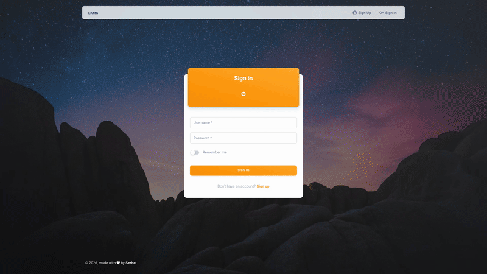

# EKMS: Enterprise Knowledge Management System

A full-stack knowledge management platform with a rich block-based editor, hierarchical page structure, and collaborative workspace organization.

**Live demo:** [ekms.avenholding.com](https://ekms.avenholding.com)

> For demo credentials, reach out via [LinkedIn](https://www.linkedin.com/in/serhat-keskin).



---

## Features

- **Block editor**: drag-and-drop blocks (headings, paragraphs, lists, code, images) powered by BlockNote
- **Page hierarchy**: nested pages with tree navigation and emoji icons
- **Dashboard**: kanban boards, data grids, and chart widgets
- **Search**: full-text search across all pages
- **User management**: role-based access, JWT auth, profile settings

## Stack

| Layer | Tech |
|---|---|
| Frontend | React 18 + Vite, MUI, BlockNote 0.44, Zustand |
| Backend | Django 5.1 + DRF, Channels (WebSocket), Daphne |
| Database | PostgreSQL 16 |
| Cache | Redis |
| Hosting | Cloudflare Pages (frontend) + isolated Docker VM (API) |

## API

Backend runs at `https://ekms-api.projects.serhatkeskin.com`

```
GET  /api/health/          -> {"status": "ok"}
POST /api/auth/login/      -> JWT access + refresh tokens
GET  /api/pages/           -> page list
GET  /api/pages/{id}/      -> page detail with blocks
POST /api/pages/blocks/    -> create block
```

## Local development

```bash
# Prerequisites: Docker + Docker Compose

cp .env.example .env          # set DJANGO_SECRET_KEY, ADMIN_KEY
docker compose -f docker-compose.local.yml up -d --build

# Frontend: http://localhost:3000
# Backend:  http://localhost:8000/api/health/
```
